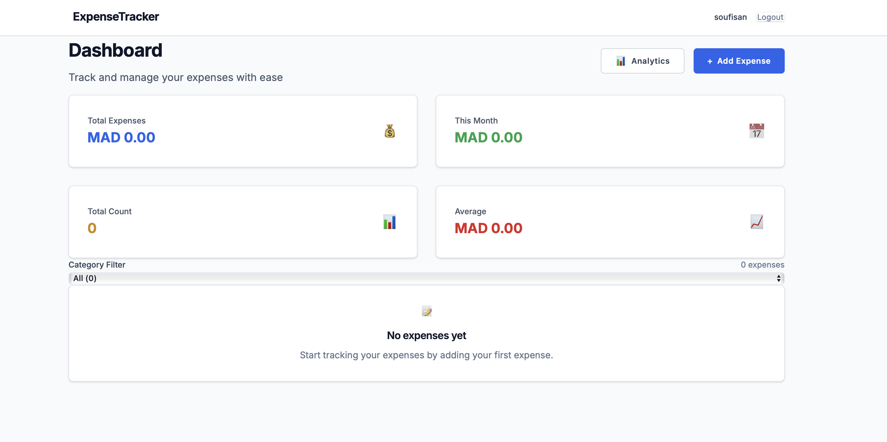
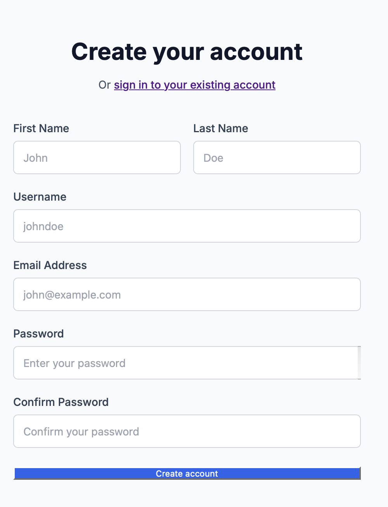
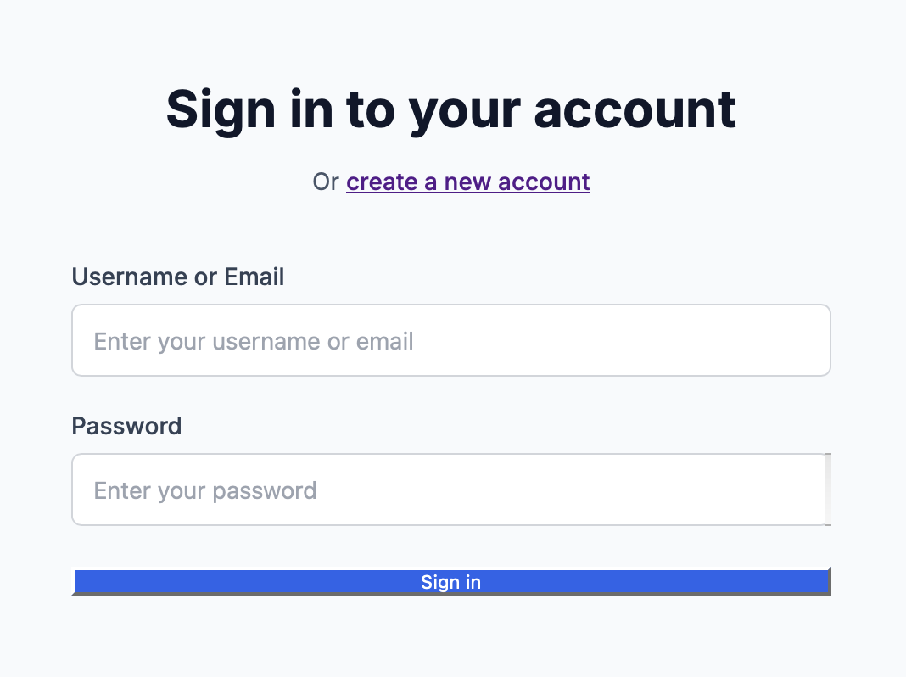
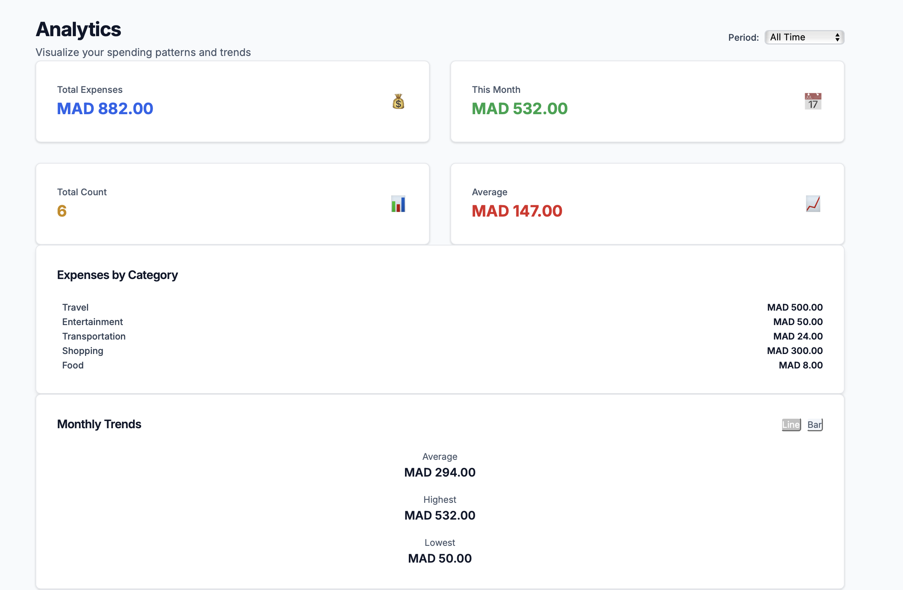
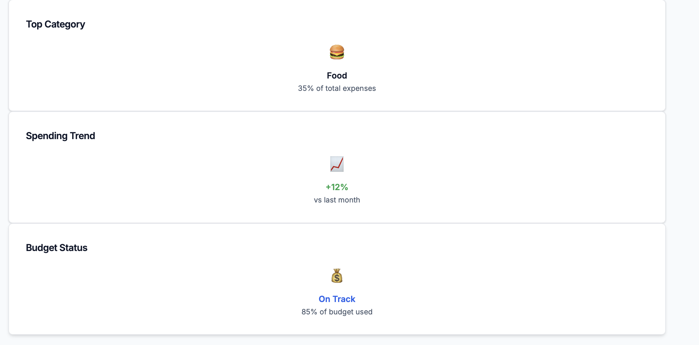

# 💰 Expense Tracker

A full-stack web application for tracking personal expenses with analytics and user authentication. Built with Spring Boot, PostgreSQL, and React.



## 🚀 Features

### ✨ Core Functionality
- **Financial Overview**: Dashboard with spending summaries and trends


 
- **Expense Management**: Add, view, edit, and delete expenses
- **Categorization**: Organize expenses by categories (Food, Transportation, Entertainment, etc.)
- **Search & Filter**: Find expenses by date, category, or amount range


### 🔐 Authentication & Security
- User registration and login with JWT authentication
- Secure password hashing with BCrypt
- Protected routes and user session management
- Token-based API authentication
 



### 📊 Analytics & Insights
- Interactive charts showing spending patterns
- Category-wise expense breakdown 
- Monthly spending trends 
- Statistical summaries (Total, Average, Monthly totals)
  
 

### 💻 User Experience
- Responsive design for desktop and mobile
- Real-time form validation
- Loading states and error handling
- Intuitive expense filtering and categorization

## 🛠️ Technology Stack

### Backend
- **Framework**: Spring Boot 3.2.0
- **Database**: PostgreSQL 15
- **Security**: Spring Security with JWT
- **ORM**: Spring Data JPA / Hibernate
- **Build Tool**: Maven
- **Java Version**: 17

### Frontend
- **Framework**: React 18
- **Routing**: React Router v6
- **Styling**: Tailwind CSS
- **Charts**: Recharts
- **HTTP Client**: Axios
- **Build Tool**: Vite
  
### Testing & Quality Assurance
- **Backend Testing**: Comprehensive JUnit 5 test suite
- **Frontend Testing**: Jest & React Testing Library

## 📁 Project Structure

```
expense-tracker/
├── backend/                    # Spring Boot API
│   ├── src/main/java/
│   │   └── com/expensetracker/
│   │       ├── config/         # Security & CORS configuration
│   │       ├── controller/     # REST API endpoints
│   │       ├── dto/           # Data Transfer Objects
│   │       ├── model/         # JPA entities
│   │       ├── repository/    # Data access layer
│   │       ├── security/      # JWT & authentication
│   │       └── service/       # Business logic
│   ├── src/main/resources/
│   │   └── application.properties
│   └── pom.xml
├── frontend/                   # React application
│   ├── src/
│   │   ├── components/        # Reusable UI components
│   │   ├── context/          # React Context (Auth)
│   │   ├── pages/            # Main application pages
│   │   └── services/         # API service layer
│   ├── package.json
│   └── vite.config.js
├── schema.sql                 # Database schema
├── docker-compose.yml         # Container orchestration
└── README.md
```

## 🚀 Quick Start

### Prerequisites
- Java 17 or higher
- Node.js 18 or higher
- PostgreSQL 15
- Maven 3.6+
- Podman/Docker (for containerization)

### 1. Clone Repository
```bash
git clone https://github.com/yourusername/expense-tracker.git
cd expense-tracker
```

### 2. Database Setup

```bash
# Create database
createdb expense_tracker_db

# Run schema
psql -d expense_tracker_db -f schema.sql

# Create user (optional)
psql -d expense_tracker_db -c "CREATE USER user_amjed WITH PASSWORD 'amjed_password123';"
psql -d expense_tracker_db -c "GRANT ALL PRIVILEGES ON DATABASE expense_tracker_db TO user_amjed;"
```


### 3. Backend Setup
```bash
cd backend

# Configure application.properties (update database settings if needed)
# Default configuration works with local PostgreSQL

# Install dependencies and run
mvn clean install
mvn spring-boot:run

# Backend will start on http://localhost:8080
```

### 4. Frontend Setup
```bash
cd frontend

# Install dependencies
npm install

# Start development server
npm run dev

# Frontend will start on http://localhost:3000
```

### 5. Access Application
- **Frontend**: http://localhost:3000
- **Backend API**: http://localhost:8080/api
- **API Health Check**: http://localhost:8080/actuator/health


## 🎯 API Endpoints

### Authentication
```
POST /api/auth/register     # Register new user
POST /api/auth/login        # User login
POST /api/auth/validate     # Validate JWT token
GET  /api/auth/check-username/{username}  # Check username availability
GET  /api/auth/check-email/{email}        # Check email availability
```

### Expenses
```
GET    /api/expenses                    # Get all user expenses
POST   /api/expenses                    # Create new expense
GET    /api/expenses/{id}               # Get expense by ID
PUT    /api/expenses/{id}               # Update expense
DELETE /api/expenses/{id}               # Delete expense
GET    /api/expenses/statistics         # Get expense statistics
GET    /api/expenses/chart/category     # Category chart data
GET    /api/expenses/chart/monthly      # Monthly chart data
GET    /api/expenses/current-month      # Current month expenses
```

### User Management
```
GET    /api/user/profile     # Get user profile
PUT    /api/user/profile     # Update user profile
PUT    /api/user/password    # Update password
DELETE /api/user/account     # Delete user account
```

## 🧪 Testing

### Backend Tests
```bash
cd backend
mvn test                    # Run all tests
mvn test -Dtest=UserServiceTest  # Run specific test class
```

### Frontend Tests
```bash
cd frontend
npm test                    # Run Jest tests
npm run test:coverage       # Run with coverage report
```

## 🔧 Configuration

### Environment Variables

#### Backend (.env or application.properties)
```properties
# Database
DB_HOST=localhost
DB_PORT=5432
DB_NAME=expense_tracker_db
DB_USERNAME=user_amjed
DB_PASSWORD=amjed_password123

# JWT
JWT_SECRET=your-secret-key-here
JWT_EXPIRATION=86400000

# Server
SERVER_PORT=8080
```

#### Frontend (.env)
```bash
REACT_APP_API_URL=http://localhost:8080/api
GENERATE_SOURCEMAP=false
```

### Database Configuration
```sql
-- Default schema includes:
-- users table (id, username, email, password, first_name, last_name, created_at, updated_at)
-- expenses table (id, title, description, amount, expense_date, category, user_id, created_at, updated_at)
-- Indexes on user_id and expense_date for performance
```

## 📚 Usage Guide

### 1. User Registration
1. Navigate to `/register`
2. Fill in required information (username, email, password)
3. Optional: Add first name and last name
4. Submit to create account and auto-login

### 2. Adding Expenses
1. Click "Add Expense" button on dashboard
2. Fill in expense details:
   - Title (required)
   - Amount (required)
   - Date (required)
   - Category (optional, defaults to "General")
   - Description (optional)
3. Submit to save expense

### 3. Managing Expenses
- **View**: All expenses displayed on dashboard
- **Edit**: Click "Edit" button on any expense
- **Delete**: Click "Delete" button with confirmation
- **Filter**: Use category filter buttons
- **Search**: Filter by date range or category

### 4. Analytics
1. Navigate to `/analytics`
2. View spending insights:
   - Category breakdown (pie chart)
   - Monthly trends (line/bar chart)
   - Statistical summaries
   - Spending patterns

## 🚦 Troubleshooting

### Common Issues

#### Database Connection
```bash
# Check PostgreSQL status
pg_ctl status

# Restart PostgreSQL
brew services restart postgresql  # macOS
sudo systemctl restart postgresql  # Linux
```

#### Port Conflicts
```bash
# Check what's running on port 8080
lsof -i :8080

# Kill process if needed
kill -9 <PID>
```

#


---

**Happy expense tracking! 💰**
